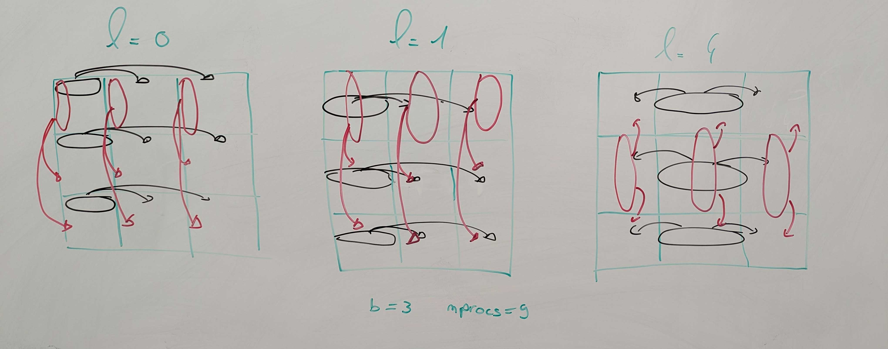
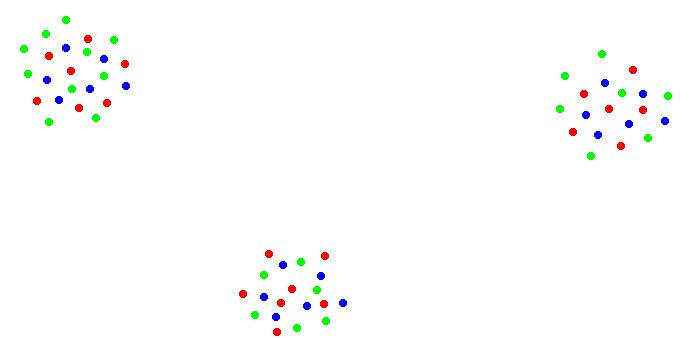
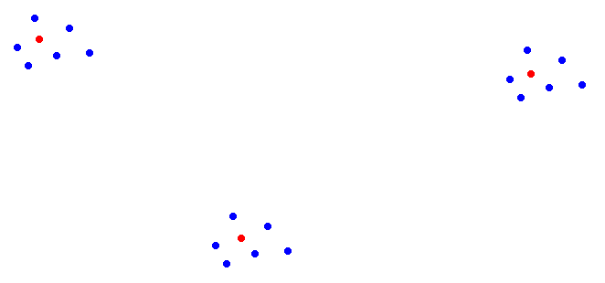
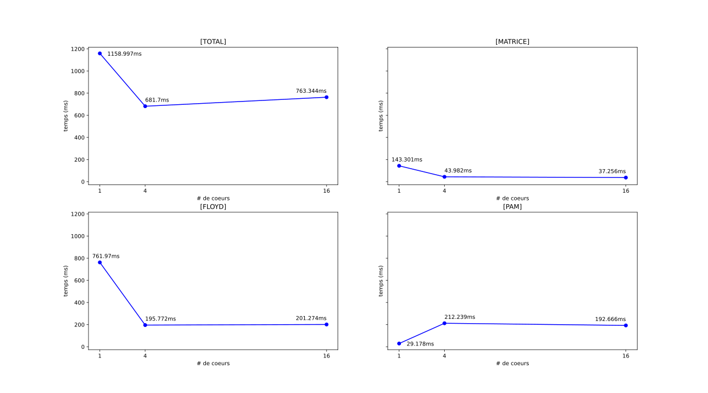
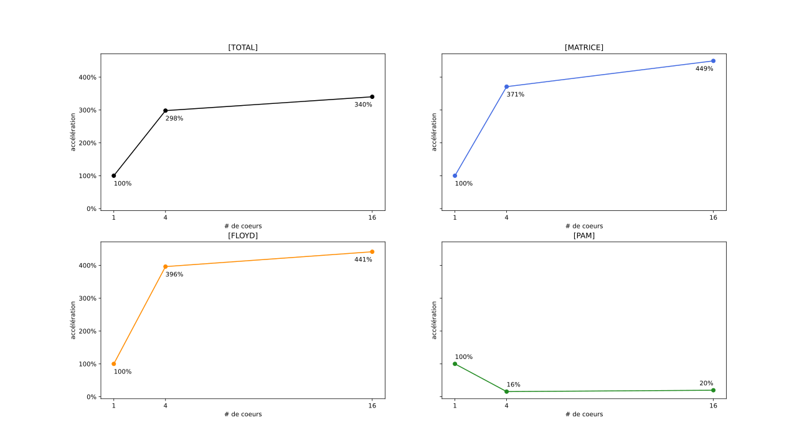
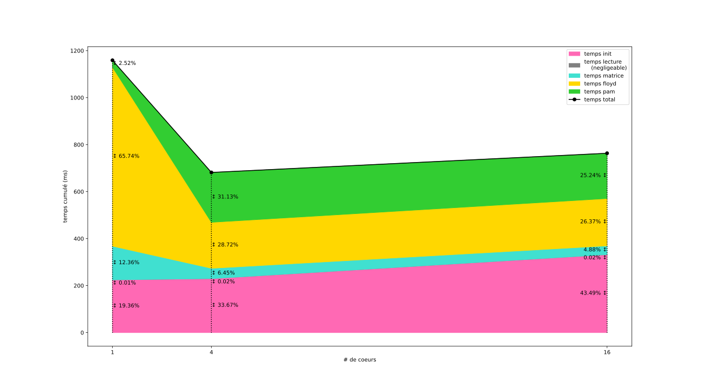

# Programmation Parallèle - Projet 1 - MPI
*Joachim Larrouy (M1 ARIAS Recherche) - Nathan Rissot (M1 ARIAS GPEx)*

L'objectif de ce projet est, dans un premier temps, de construire une version parallèle des algorithmes de Roy-Floyd-Warshall, puis PAM, afin de pouvoir identifier $k$ communautés centrées autour de $k$-médoïdes.

Puis, dans un second temps, d'adapter le processus de traitements à des données sous la forme de séquences d'ARN

## Roy-Floyd-Warshall

L'algorithme de Roy-Floyd-Warshall (parfois simplement appelé Floyd dans la suite de ce rapport) permet de construire `mat_distance` la matrice des plus courtes distances définie comme

$$
\forall i,j \in V, \mathtt{mat\_distance}[i][j] = \min(\omega (i,*,j))
$$
(avec $\omega (i,*,j)$ le plus court chemin de $i$ à $j$ dans le graphe).

Cet algorithme prend en entrée la matrice d'adjacence `mat_adjacence` préparée du graphe. On définit `mat_adjacence` comme

$$
\forall i,j \in V, \mathtt{mat\_adjacence}[i][j] = 
\begin{cases} 
    0 \text{ si } i = j \\
    \omega(i,j) \text{ si } (i,j) \in E \\
    \infin \text{ sinon} 
\end{cases} 
$$

La version séquentielle de cet algorithme consiste en une triple boucle $l$,$i$,$j$ de $0$ à $|V|$. L'algorithme séquentiel s'exécute donc en temps $\Theta (||V||^3)$. On peut en décrire le fonctionnement avec le pseudocode suivant

```pseudocode
pour l de 0 à nb_nodes,
│ pour i de 0 à nb_nodes,
│ │ pour j de 0 à nb_nodes,
│ │ │ mat_dist[i][j] = min(mat_dist[i][j], mat_dist[i][l] + mat_dist[l][j])
╰ ╰ ╰ 
```

La parallélisation de cet algo repose sur le découpage en $x$ blocs de taille $b \times b$ (avec $b = \frac{ ||V|| }{\sqrt{x}}$).

En effet, à chaque itération de la boucle, un bloc n'a besoin que d'une ligne de données reçue de sa colonne de blocs, et d'une colonne de données reçue de sa ligne de blocs. En partageant donc les blocs entre $x$ coeurs, et en les faisant partager les lignes et colonnes de données utiles, on peut effectuer les opérations de comparaisons en simultané, ce qui accélère l'exécution.



Pour effectuer ce découpage en bloc nous utilisons des communicateurs cartésiens créés grâce aux instructions `MPI_Cart_create` et `MPI_Cart_sub`. Chaque coeurs appartient donc à un des communicateurs en colonne et un des communicateurs en ligne.

## PAM

### Presentation général.

L'algorithme PAM est un algorithme ayant pour but de déterminer dans notre ensemble de noeud (noté $V$) un sous-ensemble $K$ (que l'on va nommer ensemble de medoïdes) tel que le coût de notre sous-ensemble $K$ soit le plus petit possible. Le coût d'un sous-ensemble est défini de la manière suivante :

$$
\text{coût} = \sum_{n = 0}^{nb\_nodes} \min (\omega(node_n,k_{i}))
$$

- avec $k_i$ un noeud appartenant au sous ensemble $K$.
- $node_n$ le $n$-ième noeud.
- $\omega(n_1,n_2)$ la distance entre deux noeuds au sein de notre matrice des distances.

Pour ce faire, l'algorithme choisi effectue les opérations suivantes.

- Initialiser notre ensemble de medoïde avec un tirage de noeud aléatoire.
- Pour chaque noeud $n$ appartenant à $( \{V \\ K\} )$ On calcule le coût du remplacement de chaque medoïde par $n$. Si le coût le plus faible entre toutes nos substitutions $(\text{swap}(n,k_i) = \text{coût}_{\min} )$ est plus faible que le coût de l'ensemble $K$ à l'itération courante, alors on substitue $k_i$ par $n$.

Une fois tout les noeuds evalué, on considère avoir un sous ensemble $K$ représentant une solution satisfaisante à notre recherche de coût minimum.

### Notre heuristique
Le coût de l'algorithme glouton effectuant le calcul des meilleurs médoïdes jusqu'à stabilisation ayant un coût $O(n^2*k^2)$ nous avons choisi d'appliquer une initialisation avec l'heuristique suivante.

Lors de l'initialisation, plutôt que de partir de noeud aléatoire, une approche pourrait être de découper en ligne notre matrice des distances, et de déterminer pour chaque fragment un ensemble de noeud qui minimise le coût local a ce fragment.

Puis on choisit comme noeud de départ pour les médoïdes, les noeuds ayant était choisis le plus de fois parmis comme faisant partis des noeuds minimisant les couts locaux.

Comme le calcul du coût favorise les noeuds présent au sein du fragment et que chaque fragment à une probabilité $\frac{1}{nb\_fragment}$ de posséder un médoïde $k_i$. Il convient de retirer du choix possible les noeuds présent dans notre fragment.

<div style="display: grid; grid-template-columns: 1fr 1fr; gap: 1em;"><figure><figcaption aria-hidden="true"><i>fig 2. Représentation du graphe global</i></figcaption></figure><figure><figcaption aria-hidden="true"><i>fig 3. Représentation du fragment local</i></figcaption></figure></div>

Le coût étant de l'ordre de $n^2$, fragmenter suffisamment la matrice permet de faire un pré-calcul relativement rapide.

> **Remarque** : 
> Dans le cas où la taille des données reste trop grande pour effectuer ce pré-traitement, il est aussi possible de n'effectuer celui-ci que sur un échantillon de notre donnée.

## Application à des données de séquences d’ARN

Pour l'application des algorithmes à ce nouveau type de donnée, la seule adaptation que nous avons dû faire à été de programmer un nouveau parseur pour extraire les données du fichier source, et de mettre en place la génération de la matrice d'adjacence sur ces données.

### Parsing du fichier

Les fichiers aillant une structure assez simple, le parseur en lui même (contenu dans `readArnFromFile`) consiste simplement à placer et à aligner les chaines de caractères extraite du fichier dans une matrice de taille $nb\_nodes \times ||séquence\ arn||$. Cette opération n'est pas parallélisable, toutes les données etant stockées dans le même fichier, mais son temps d'exécution est négligeable (cf fig 7, le temps de lecture n'apparait même pas sur le graphique)

### Construction de la matrice d'adjacence

La construction de la matrice d'adjacence en revanche est parallélisable:

1. ROOT partages les séquences d'ARN avec un `Scatterv` de sorte que chaque coeur dispose de $\left(\frac{nb\_nodes}{nprocs}\right) (\pm 1)$ séquences.
2. Les coeurs `Bcast` leurs fragment à tout les autres coeurs.
3. Les coeur utilisent les données reçue pour calculer la distance de hamming entre chaque séquences reçue et chaque séquence dans leurs propre fragment, puis notent le résultat dans leurs matrice.
4. ROOT `Reduce` avec une somme les matrices (initialisées à 0) de chaque coeur.

> **Remarque** :
> Ce coeur est techniquement inefficace car la matrice est symétrique, ce qui signifie que chaque séquence est comparé avec chaque autre séquence deux fois. Pour regler cette inneficacité il faudrait pouvoir découper la charge de travail de manière triangulaire.

> **Remarque** : 
> Dans un soucis de simplicité d'écriture, chaque coeur réserve en mémoire une matrice complète de taille $nb\_nodes \times nb\_nodes$. Cette facilité à été laissée comme amélioration potentielle au moment de l'écriture, et est toujours dans le code aujourd'hui par manque de temps.

Une fois la matrice d'adjacence obtenue, on peut procéder au découpage par blocs de celles-ci pour l'algorithme de Roy-Floyd-Warshall afin d'obtenir la matrice des distances des plus courts chemins comme précedemment, puis au découpage par ligne afin d'utiliser PAM pour obtenir les $k$-médoïdes.

## Benchmarks & Analyses

> **Remarque** :
> Nous n'avons effectué des Benchmarks que sur les séquences d'ARN car les temps de calculs sur les exemples de graphes donnés etaient trop court, et les différences de temps venaient plus de facteurs extérieurs (temps d'initialisation de MPI, opération OS) que du code lui même.

Les bench ont été effectués sur un processeur de type I5-10300 diposant de 6 coeurs physiques. Les test sur 16 processeurs ont donc été lancé avec l'option `--oversubscribe`. 

De plus, nous n'avons pas lancé de test avec 9 coeurs, car les tailles des fichiers de séquences d'ARN (500 et 2k) ne sont pas divisible par $\sqrt{9} (=3)$ et donc ne respectent pas les hypothèses favorables dont dépend notre implémentation de l'algorithmes de Roy-Floyd-Warshall




Sur ces graphes des temps d'execution moyens, on remarque que pour presque toutes les étapes, le temps de calcul diminue au fur et à mesure que l'on augmente le nombre de processus (CF, fig 6. les courbes d'accélérations). 



Cepandant on remarque que pour PAM, le temps de calcul augmente légerement entre la version séquentielle et la version parallélisée. Cela est dù au fait que l'implémentation du premier calcul qui nous permet d'avoir une initialisation fiable des premiers candidats ne fonctionne pas avec un seul processeur, et à donc été remplacé par un simple choix aléatoire.



Comme on peut le voir sur le graphe des courbes cumulés, ce changement implique qu'une plus grande part du temps d'execution total est dédié a cette étape, mais on peut aussi constater que les résultats obtenus par les executions de l'algorithme avec le pré-traitement heuristique sont bien meilleurs


> **Calcul de l'accelération** : 
> $$\text{speedup} = \frac{T_{seq}}{T_{nprocs}} \times 100$$

## Retour sur l'Heuristique

Comme vous avez pu l'observer sur les figures précédentes, il semble que l'heuristique que nous avions formulée sur la manière d'améliorer l'algorithme PAM n'est pas le franc succès que nous esperions.

En effet si l'on compare les résultats obtenus avec et sans l'heuristique (sans l'heuristique ici signifie que l'on séléctionne $k$ candidats aléatoires), on peut observer que l'on obtient bien un résultat de meilleur qualitée (coût de 160773 contre 161503), mais ce résultat n'est que 0,45% meilleur, alors que les temps d'executions sont bien pire.

```
  .-------------------+------------------+-----------------+------------.  
  |                   | avec heuristique | choix aléatoire |  variation |  
  +-------------------+------------------+-----------------+------------+  
  | coût du résultat  |           160773 |          161503 |    +0,45 % |  
  | temps d'execution |      11413,32 ms |     442,1096 ms |   -96,13 % |  
  '-------------------+------------------+-----------------+------------'  
```
*fig 8. Comparaison des résultats et du temps d'execution de PAM pour 2k noeuds et 16 coeurs (*`--oversubscribe` *utilisé) avec et sans heuristique*

> **Remarque** : ces tests ont été faites sur une machine différente de celle utilisée pour les bench. 

Il convient toutefois de remettre ce chiffre en perspective, cette variation bien que grande reste inférieur au temps d'initialisation ou au temps d'execution de l'algorithme de Roy-Floyd-Warshall.

Lors des benchs, nous somme arrivé à la conclusion que l'heuristique proposée n'est pas adaptée au problème, l'augmentation est trop faible pour justifier l'augmentation de coût qu'elle produit, cepandant elle etait prometteuse et nous avons décidé de la garder dans le code dans une démarche de transparence, le but de ce rapport etant de montrer le travail effectué durant le projet.

