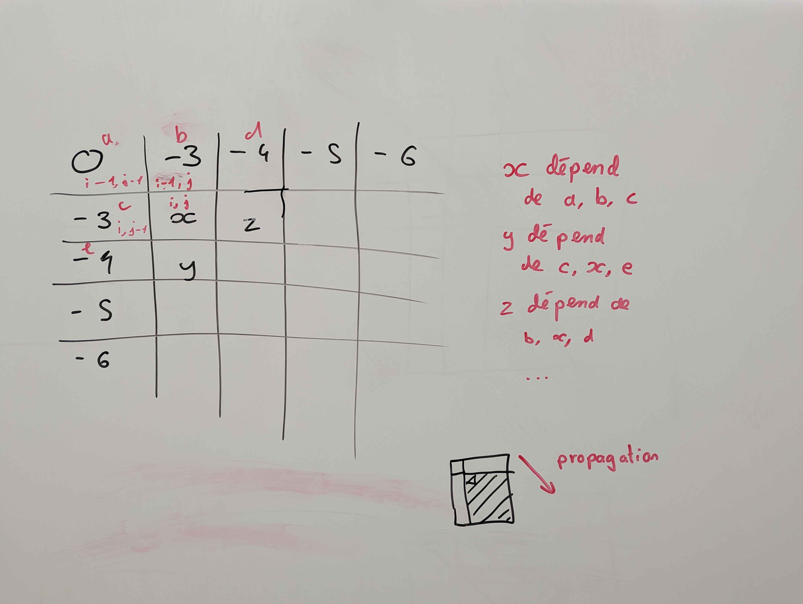
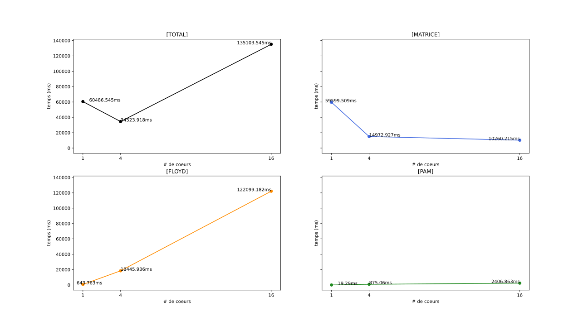
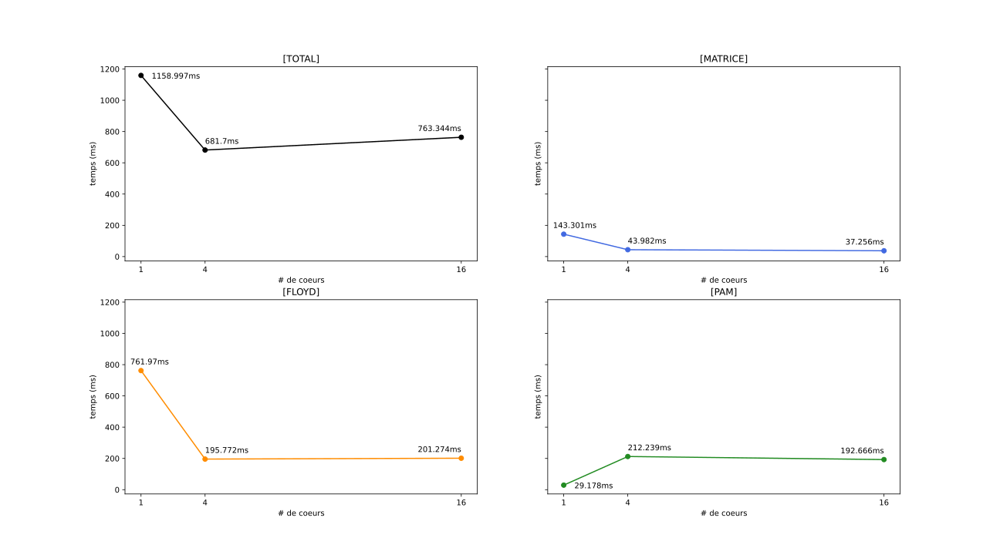
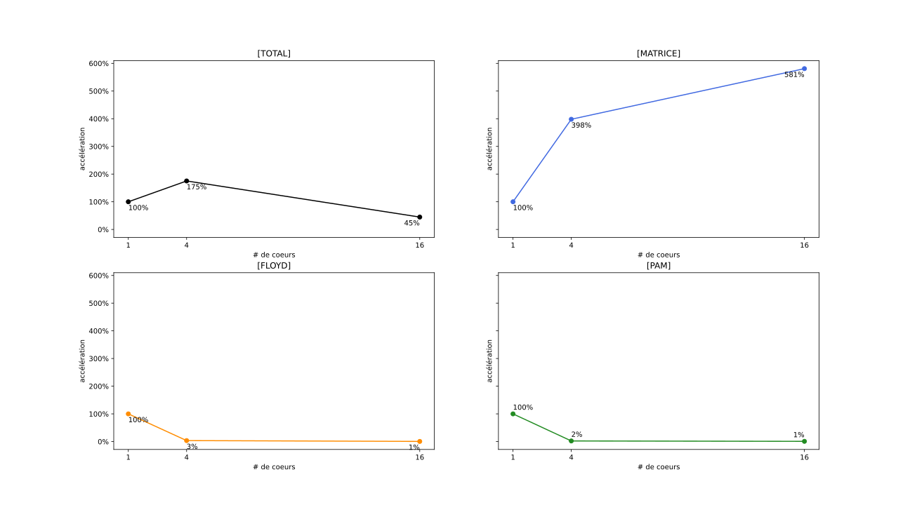
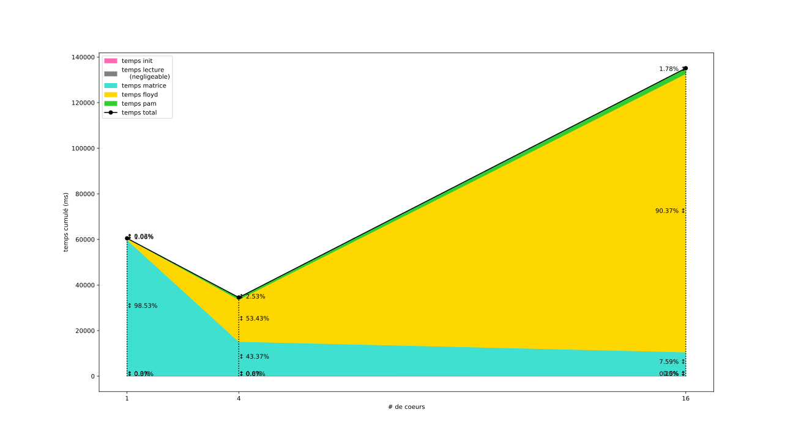

# Programmation Parallèle - Projet 2 - OMP
*Joachim Larrouy (M1 ARIAS Recherche) - Nathan Rissot (M1 ARIAS GPEx)*

L'objectif de cet deuxième partie de projet à été dans un premier temps d'améliorer la fonction de distance entre les séquences d'ARN, en passant de la distance de Hamming, qui est rapide, mais pas assez précise au score de Needleman-Wunsch.

Puis dans un second temps d'essayer de paralléliser le reste du programme à l'aide de la librairie OMP

## Needleman-Wunsch

### Présentation générale

Jusque là, notre approche pour déterminer la distance entre deux séquences ARN restait naïve.
Par exemple, lors d'une mutation, une séquence d'ARN pourrait se voir ajouter un nouveau nucléotides au début et perdre son dernier. La distance calculé jusqu'alors entre la nouvelle séquence obtenue et l'original serait alors très importante. Pourtant les deux séquences ARN sont très similaire.

L'algorithme de Needleman-Wunsch permet de déterminer une distance entre deux séquences plus pertinente dans le contexte biologique.

Pour cela, l'idée étant de comparer deux séquences d'ARN. Comme précédemment, si deux caractères sont différents, alors on retire un au score de similarité. Mais on garde la possibilité de reconnaître des séquences similaires qui ne seraient pas parfaitement alignés.

On ajoute donc la possibilité d'insérer un trou dans la séquence. La création de e trou engendre un surcoût pour le score, de $-3$ dans notre cas. Alors que l'extension d'un trou existant représente un coût de $-1$ . Le nombre d'agencement étant très important, une approche dynamique est nécessaire pour déterminer le meilleur agencement possible.

On représente dans une matrice $F$ les score de similarités entre nos deux séquence ARN de la manière suivante :
$F(i,j)$ représente le meilleur score permettant de joindre la première séquence d'arn jusqu'au $i$-ème caractère avec la deuxième séquence d'arn jusqu'au $j$-ème caractère.

Pour déterminer $F(i,j)$ on calcule le maximum entre $F(i-1,j-1) + S(arn1[i],arn2[j])$, ou bien $F(i-1,j) +$ la création ou l'agrandissement d'un trou, ou encore $F(i,j-1) +$ la création ou l'agrandissement d'un trou.

Cette approche permet de calculer le meilleur score possible qui se trouvera dans la case F(len(arn1),len(arn2)) de notre matrice $F$.

Pour déterminer si un trou est ajouté ou agrandi, une deuxième matrice $H$ contenant des booléens est actualisé a chaque étape. Si $H(i,j-1)$ (resp. $H(i-1,j)$) vaut `true`, alors on sait qu'il s'agit d'un agrandissement de trou déjà existant ce qui permet d'appliquer la pénalité de $-1$.
Dans le cas ou le booléen vaut `false`, alors il s'agit d'une ouverture de trou et la pénalité de $-3$ et appliqué. 


## Parallélisation de Needleman-Wunsch

### Logique de parallélisation

On peut voir dans l'implémentation séquentielle que chaque étape $i,j$ de la double boucle ne dépend que de trois autres cases ($\{ (i-1, j-1), (i-1, j), (i, j-1) \}$).



On peut donc utiliser la directive `#pragma omp task`. Chaque tâche est indépendantes de l'id du proc, on peut donc spécifier que les tâches sont `untied`. Enfin, il ne reste plus qu'a remplir les dépendances (`depend()`) d'entrée (`in :`) et de sortie (`out :`).

Pour créer les taches, on affecte la double boucle à une région `#pragma omp single nowait` pour qu'un seul thread crée les tâches, et que les autres thread n'attendent pas avant de travailler sur les tâches.

### Implémentation

```cpp
int nw_distance_omp(const char *A, int lenA, const char *B, int lenB)
{
	int *F = new int[lenA * lenB];
	bool *H = new bool[lenA * lenB];

	F[0] = 0;

	for (int i = 1; i < lenA; ++i)
	{
		F[i * lenB] = GAP_PENALTY - i;
	}

	for (int j = 1; j < lenB; ++j)
	{
		F[j] = GAP_PENALTY - j;
	}

#pragma omp parallel
	{
#pragma omp single nowait
		{
			for (int i = 1; i < lenA; ++i)
			{
				for (int j = 1; j < lenB; ++j)
				{
#pragma omp task untied depend(in : F[(i - 1) * lenB + j - 1], F[(i - 1) * lenB + j], F[i * lenB + (j - 1)]) depend(out : F[i * lenB + j])
					{
						_choose_and_write(F, H, i, j, A[i], B[j], lenA, lenB);
					}
				}
			}
		}
	}
	const int score = F[(lenA * lenB) - 1] +1;
	delete[] F;
	return score;
}

void _choose_and_write(int *F, bool *H, int i, int j, char a, char b, int lenA, int lenB)
{
	int _match = F[(i - 1) * lenB + (j - 1)] + (a == b ? MATCH_REWARD : MISMATCH_PENALTY);
	int _delete = F[(i - 1) * lenB + j] + ((H[(i - 1) * lenB + j]) ? EXTEND_PENALTY : GAP_PENALTY);
	int _insert = F[i * lenB + (j - 1)] + ((H[i * lenB + (j - 1)]) ? EXTEND_PENALTY : GAP_PENALTY);
	int choice = max(max(_match, _insert), _delete);
	F[i * lenB + j] = choice;
	H[i * lenB + j] = choice != _match;
}
```
### Résultat

```
.----------+------------------------------.
| Variante | Temps d'execution moyen (ms) |
+----------+------------------------------+
| SEQ      |                      0.267ms |
| OMP      |                      6.971ms |
'----------+------------------------------'
```

Comme on peut le voir, la parallélisation avec OMP multiplie le temps d'éxecution par environ 26.

C'est probablement du au temps relativement long généré par la création et la gestion des tâches par OMP.

Pour l'implémentation finale, nous avons donc choisi d'utiliser la version séquentielle de cette algo, car le faible nombre de thread sur nos machines de tests ne nous donnait pas de résultats satisfaisant.

## Logique de parallélisation avec MPI et OMP.

La parallélisation avec OMP prend avantage des threads de chaque CPU. les benchmarks ci dessous on été effectué avec la même machine que pour la partie 1 (12 coeurs, 2 thread par coeur). 

On peut donc s'attendre a ce que lorsque que l'on lance le programme avec un grand nombre de coeurs pour MPI (-np 16) on ait des avantages plutôt médiocre avec cette parallélisation. En revanche, lorsque que l'on va lancer le programme avec 4 coeurs, on devrait avoir de meilleurs résultats.

Pour utiliser OMP avec MPI, on va essayer de cibler les fonction qui sont appellées sur chaque processus. De cette maniere, on a une premiere phase de parallélisation ou on partage les données entres les coeurs avec MPI, puis une deuxieme phase ou l'on traite les données partagées avec OMP.

Nous nous sommes donc concentré sur les fonction hors de `main.cpp`:

### `cost_from_candidate_set`

Itérations de la boucle indépendantes les unes des autres, on peut donc remplacer la boucle `for` par un `parallel for`. Il faut bien penser à mettre l'instruction `atomic` avant l'incrémentation pour proteger l'écriture dans la somme.

```c++
int cost_from_candidate_set(int *mat_distance_fragment, int *candidates, int k, int nb_nodes, int nb_lignes_fragment)
{
    int sum = 0;
#pragma omp for
    for (int current_node = 0; current_node < nb_lignes_fragment; current_node++)
    {
        int min_current = INF;
        for (int i = 0; i < k; i++)
        {
            min_current = min(mat_distance_fragment[current_node * nb_nodes + candidates[i]], min_current);
        }
#pragma omp atomic
        sum += min_current;
    }
    return sum;
}
```

### `calculate_cost_fragment`
Très similaire à `cost_from_candidate_set`

```c++
int calculate_cost_fragment(int *medoids, int K, int *mat_distance_fragment, int nb_nodes, int nb_lignes)
{
    int sum = 0;
#pragma omp parallel for 
    for (int i = 0; i < nb_lignes; ++i)
    {
        int min = mat_distance_fragment[i * nb_nodes + medoids[0]];
        for (int j = 1; j < K; ++j)
        {
            if (mat_distance_fragment[i * nb_nodes + medoids[j]] < min)
            {
                min = mat_distance_fragment[i * nb_nodes + medoids[j]];
            }
        }
        #pragma omp atomic 
        sum += min;
    }
    return sum;
}
```

#### MAIS

lors de test je me suis apercu que cette parallélisation entraine de trop grandes pertes de performances sur l'ensemble du programme (2.5 fois pire). 

- Avec : temps total : 88286.6ms
- Sans : temps total : 34721.5ms

### `scatteredFloydAlgorithm` : boucle principales

La double boucle principale (celle qui fait les calculs de minimum pour chaque case du bloc) peut être parallélisé car chaque case est indépendantes des autres.

```c++
[...]

#pragma omp parallel for shared(bloc, recv_from_COMM_COL, recv_from_COMM_LINE)
        for (int i = 0; i < b; ++i)
        {
            for (int j = 0; j < b; ++j)
            {
                bloc[i * b + j] = min(bloc[i * b + j], recv_from_COMM_COL[j] + recv_from_COMM_LINE[i]);
            }
        }

[...]
```

### Ouvertures.

Nous aurions aimé avoir le temps de paralléliser les fonctions `prepareForScatter` et `repareAfterGather` qui nous permettent de préparer et de réparer la matrices pour que le partage en bloc/aggrégation puisse se faire avec un simple Scatter/Gather.

Ces fonctions font théoriquement des étapes indépendantes les unes des autres, mais l'implémentation que nous avions initialement choisi utilise un curseur qui est incrémenté au fur et a mesure pour faciliter la conversion.

Nous n'avons pas eu le temps de reprendre ces fonctions pour les rendres parallélisables.

## Benchmarks



Comme attendu c'est avec 4 processeurs que le calcul est le plus rapide. On peut voir que la parallélisation de la boucle a l'intérieur de la partie Floyd cause une grosse augmentation du temps de calcul quand on utilise plus de 4 coeurs.



En comparant avec les résultats de la partie 1 (figure ci-dessus), on voit que le temps a empiré sur tout les domaines ou nous avons essayer de paralléliser.

Ces faibles performances sont probablement expliqué par la relative faible taille des données traitées, combiné a notre mauvaise maitrise de la combinaison entre OMP et MPI, et à la configuration de nos machine de dev/ test.

Nous aurions probablement eu des résultats plus convenables avec des machines avec plus de threads, ou une grappe de machine.

En utilisant MPI pour partager les données entre les machines, et OMP pour traiter les données au sein des machines.





> Nous n'avons malheureusement pas pu tester notre code sur le jeu de données de 2000 séquences, car la machine que nous avons utilisé pour les bench (poste de la salle ES4) n'a pas réussi à le faire tourner. Nous n'avons pas eu le temps de chercher les causes, mais nous suspectons que notre code sature trop les processeurs et threads.

